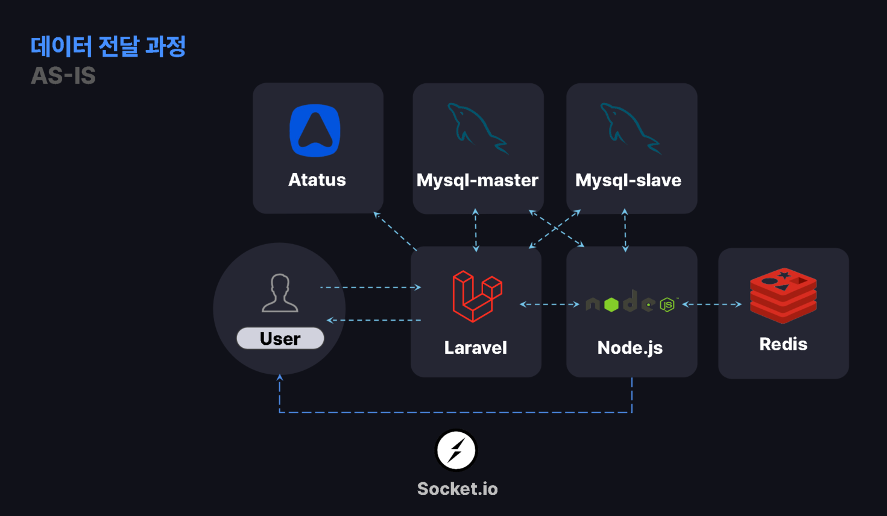
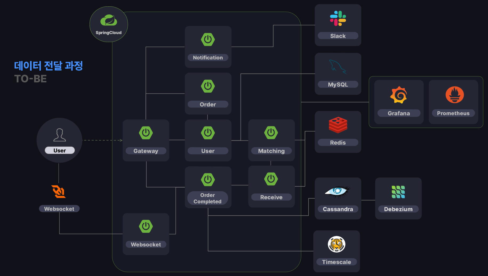

# 코인 거래소 마이크로서비스 아키텍처 개선 프로젝트

## 프로젝트 개요
기존 모놀리식 아키텍처로 구성된 코인 거래소 시스템을 마이크로서비스 아키텍처로 전환하여 확장성과 성능을 개선한 사례입니다. 초당 수만 건의 거래를 안정적으로 처리할 수 있는 시스템을 구축했습니다.

## 기존 구조와 문제점

### 아키텍처 구성


### 주요 문제점
| 문제 영역 | 세부 내용 |
|---------|----------|
| **서버 부하 집중** | - Node.js 서버가 체결, 차트, 블록체인 연결 등 다양한 작업 담당<br>- 모든 코인에 대한 거래 처리 시 성능 병목 현상 발생 |
| **DB Lock 경합** | - Laravel과 Node.js가 동일한 DB 사용 시 트랜잭션 Lock 충돌<br>- Deadlock 및 성능 저하 발생 |
| **통신 신뢰성 부족** | - HTTP 동기식 통신으로 인한 이벤트 유실 가능성<br>- 네트워크 장애 시 재시도 메커니즘 부재 |
| **부적합한 데이터 구조** | - 대량 데이터 집계 시 전체 테이블 스캔 필요<br>- 시계열 데이터 처리에 특화된 DB 부재 |
| **데이터 정밀도 문제** | - 부동소수점 연산 오류 발생<br>- 금융 데이터 정확성 저하 |

## 아키텍처 개선 방안

### 개선된 아키텍처


### 주요 개선 사항
#### 1. 마이크로서비스 아키텍처 도입
- Gateway, 주문, 사용자, 매칭, 리시버, 체결, WebSocket 서버로 기능별 분리
- 각 서비스별 독립적 스케일링으로 부하 분산 및 가용성 향상

#### 2. 체결 성능 개선
- 비관적 락, Redis 분산 락, Lua 스크립트 활용으로 트랜잭션 충돌 방지
- 미체결 수량 업데이트를 스케줄러 기반 주기적 동기화로 변경하여 Lock 경합 최소화

#### 3. Kafka 기반 이벤트 드리븐 아키텍처
- HTTP 동기식 통신을 Kafka 비동기 메시징으로 대체
- 주문 및 코인별 파티션 분할로 대용량 주문 이벤트의 병렬 처리

#### 4. 특화 데이터베이스 도입
- **TimescaleDB**: 차트 데이터 및 시계열 분석에 최적화
- **Cassandra**: 대용량 체결 데이터의 빠른 쓰기와 영구 보관
- **Redis**: 빠른 체결을 위한 미체결 데이터 캐싱 활용

#### 5. 언어 및 프레임워크 개선
- Node.js에서 Java/Spring Boot로 전환
- 강타입 언어의 컴파일 타임 체크를 통한 데이터 안정성 확보


### env.properties 설정
```bash
## 프로젝트 디렉토리로 이동
cd matching/src/main/resources/properties
```
```properties 
DB_HOST=jdbc:mysql://localhost:3306/exchange
DB_NAME=default
DB_PASSWORD=1234

KAFKA_HOST=localhost
KAFKA_NAME=default
KAFKA_PASSWORD=1234

EUREKA_HOST=localhost
EUREKA_NAME=default
EUREKA_PASSWORD=1234

REDIS_HOST=localhost
REDIS_NAME=default
REDIS_PASSWORD=1234

CASSANDRA_HOST=localhost
CASSANDRA_NAME=default
CASSANDRA_PASSWORD=1234
```

### Docker Compose 실행
```bash
# docker 디렉토리로 이동
cd docker

# 기본 서비스 실행
docker compose -p default -f docker-compose.default.yml up -d
# 다른 compose 파일도 동일한 방법으로 실행가능
```
### cdc 실행

```bash
# cdc 디렉토리로 이동
cd cdc

# Debezium Connector 실행
java --add-exports java.base/jdk.internal.misc=ALL-UNNAMED \
--add-exports java.base/jdk.internal.ref=ALL-UNNAMED \
--add-exports java.base/sun.nio.ch=ALL-UNNAMED \
--add-exports java.management.rmi/com.sun.jmx.remote.internal.rmi=ALL-UNNAMED \
--add-exports java.rmi/sun.rmi.registry=ALL-UNNAMED \
--add-exports java.rmi/sun.rmi.server=ALL-UNNAMED \
--add-exports java.sql/java.sql=ALL-UNNAMED \
--add-opens java.base/java.lang.module=ALL-UNNAMED \
--add-opens java.base/jdk.internal.loader=ALL-UNNAMED \
--add-opens java.base/jdk.internal.ref=ALL-UNNAMED \
--add-opens java.base/jdk.internal.reflect=ALL-UNNAMED \
--add-opens java.base/jdk.internal.math=ALL-UNNAMED \
--add-opens java.base/jdk.internal.module=ALL-UNNAMED \
--add-opens java.base/jdk.internal.util.jar=ALL-UNNAMED \
--add-opens=java.base/sun.nio.ch=ALL-UNNAMED \
--add-opens jdk.management/com.sun.management.internal=ALL-UNNAMED \
--add-opens=java.base/java.io=ALL-UNNAMED \
-jar debezium-connector-cassandra-5-3.1.1.Final-jar-with-dependencies.jar ./config.properties
```

### 참고 자료
- [코인 거래소 프로세스 개선](https://lead-icicle-cc1.notion.site/1f2a7b429bd080fe81fcccad3acb0610)